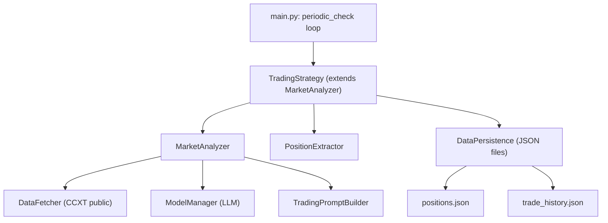
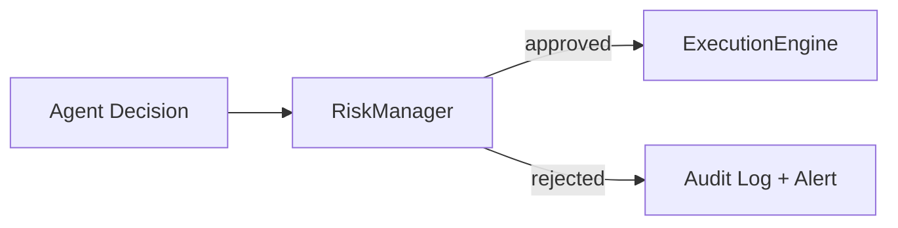
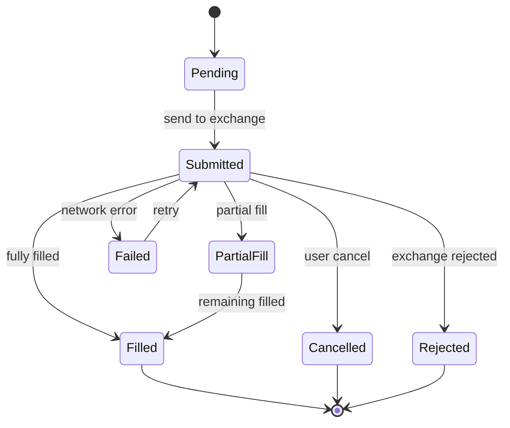
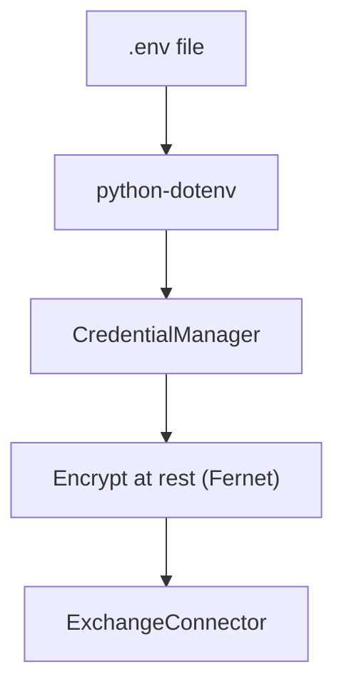

# Live Crypto Exchange Integration Plan

## Current Architecture Summary

The existing system follows this call chain:




Key facts about the current codebase:

- Exchange is **hardcoded** to `ccxt.binance()` in [core/market_analyzer.py](core/market_analyzer.py) (line 24), using only public endpoints (no API keys)
- **No execution abstraction** exists -- "trades" are `TradeDecision` dataclasses written to JSON via [core/data_persistence.py](core/data_persistence.py)
- `TradingStrategy` **inherits** from `MarketAnalyzer` (tight coupling) in [core/trading_strategy.py](core/trading_strategy.py)
- **No tests**, no CI/CD, no feature flags, no environment variable usage
- Config is via `configparser` reading [config/config.ini](config/config.ini)
- Data models are plain dataclasses in [utils/dataclass.py](utils/dataclass.py): `Position`, `TradeDecision`, `PromptContext`

---

## Phase 0: Foundation and Refactoring (Pre-requisite)

Before adding live trading, the existing code needs targeted refactoring to create clean seams.

### 0.1 Decouple TradingStrategy from MarketAnalyzer

Currently `TradingStrategy` inherits from `MarketAnalyzer`. This must become **composition** so the execution layer can be injected independently.

- `TradingStrategy` should **receive** a `MarketAnalyzer` instance (and later an `ExecutionEngine`) via constructor injection
- This is the single most important refactor -- it creates the injection point for swapping dry-run vs live execution

### 0.2 Introduce execution mode in config

Add to [config/config.ini](config/config.ini):

```ini
[execution]
mode = dry_run          # dry_run | paper | live
exchange = binance      # binance | coinbase | ...
confirm_trades = true   # require explicit confirmation before live orders
max_position_pct = 5.0  # max % of portfolio per trade
max_daily_loss_pct = 10.0
kill_switch = false     # emergency halt all trading
```

### 0.3 Switch secrets management to environment variables

Move API keys out of INI files. Use `os.environ` with a `.env` file (loaded via `python-dotenv`). The `.env` is already in `.gitignore`.

```
EXCHANGE_API_KEY=...
EXCHANGE_API_SECRET=...
EXCHANGE_API_PASSPHRASE=...  # for Coinbase
LLM_API_KEY=...
```

---

## Phase 1: Core Abstractions

### 1.1 Execution Engine Protocol (Strategy Pattern)

Create an abstract protocol that both dry-run and live modes implement:

```python
# execution/base.py
from abc import ABC, abstractmethod

class ExecutionEngine(ABC):
    @abstractmethod
    async def place_order(self, order: OrderRequest) -> OrderResult: ...

    @abstractmethod
    async def cancel_order(self, order_id: str) -> bool: ...

    @abstractmethod
    async def get_balance(self) -> AccountBalance: ...

    @abstractmethod
    async def get_open_orders(self) -> list[Order]: ...

    @abstractmethod
    async def get_order_status(self, order_id: str) -> OrderStatus: ...

    @abstractmethod
    async def sync_portfolio(self) -> Portfolio: ...
```

Two concrete implementations:

- `**DryRunEngine**` -- wraps the current JSON-based logic (preserves existing behavior exactly)
- `**LiveEngine**` -- delegates to the exchange connector layer

### 1.2 Exchange Connector Layer (Adapter Pattern)

Wrap CCXT with a uniform interface that normalizes exchange-specific quirks:

```python
# execution/connectors/base.py
class ExchangeConnector(ABC):
    @abstractmethod
    async def create_order(self, symbol, side, type, amount, price=None) -> dict: ...

    @abstractmethod
    async def cancel_order(self, order_id, symbol) -> dict: ...

    @abstractmethod
    async def fetch_balance(self) -> dict: ...

    @abstractmethod
    async def fetch_order(self, order_id, symbol) -> dict: ...

    @abstractmethod
    async def fetch_open_orders(self, symbol) -> list: ...
```

Concrete implementations:

- `BinanceConnector(ExchangeConnector)` -- Phase 1 target
- `CoinbaseConnector(ExchangeConnector)` -- Phase 2
- Future: Kraken, Bybit, OKX

Each connector wraps a CCXT exchange instance with authenticated credentials and handles exchange-specific order types, rate limits, and error codes.

### 1.3 New Data Models

Add to [utils/dataclass.py](utils/dataclass.py):

```python
@dataclass
class OrderRequest:
    symbol: str
    side: str            # "buy" | "sell"
    order_type: str      # "market" | "limit"
    amount: float
    price: Optional[float] = None
    stop_loss: Optional[float] = None
    take_profit: Optional[float] = None
    client_order_id: Optional[str] = None

@dataclass
class OrderResult:
    order_id: str
    status: str          # "filled" | "partial" | "rejected" | "pending"
    filled_amount: float
    avg_price: float
    fee: float
    timestamp: datetime
    raw_response: dict

@dataclass
class AccountBalance:
    total: Dict[str, float]
    free: Dict[str, float]
    used: Dict[str, float]
    timestamp: datetime

@dataclass
class Portfolio:
    balances: AccountBalance
    open_positions: List[Position]
    unrealized_pnl: float
    total_equity: float
```

### 1.4 Connector Factory

```python
# execution/factory.py
def create_execution_engine(config) -> ExecutionEngine:
    mode = config.get("execution", "mode")
    if mode == "dry_run":
        return DryRunEngine(config)
    elif mode == "paper":
        return PaperEngine(config)  # sandbox/testnet
    elif mode == "live":
        exchange = config.get("execution", "exchange")
        connector = create_connector(exchange)
        return LiveEngine(connector, config)
```

---

## Phase 2: Risk Management Layer

This layer sits between the agent decision and the execution engine. **Every order must pass through it.**




### 2.1 Risk Manager

Located at `execution/risk_manager.py`:

- **Kill switch**: Global halt checked before every order. Configurable via config and runtime API.
- **Max position size**: Reject orders exceeding `max_position_pct` of portfolio.
- **Max daily loss**: Track cumulative daily P&L; halt trading if `max_daily_loss_pct` breached.
- **Max open positions**: Limit concurrent positions (e.g., 3).
- **Rate limiting**: Throttle order frequency (e.g., max 5 orders/minute).
- **Restricted pairs**: Whitelist of tradeable symbols.
- **Trade confirmation**: In live mode, optionally require human confirmation (CLI prompt or webhook) before execution.
- **Cooldown period**: Minimum time between consecutive trades on same pair.

### 2.2 Pre-Trade Validation Checklist

Before any live order:

1. Kill switch is OFF
2. Account balance is sufficient
3. Order size within limits
4. Daily loss limit not breached
5. Symbol is in whitelist
6. Cooldown period elapsed
7. (Optional) Human confirmation received

---

## Phase 3: Order Lifecycle Management

### 3.1 Order State Machine




### 3.2 Order Tracker

`execution/order_tracker.py`:

- Polls exchange for order status updates (with exponential backoff)
- Emits events on state transitions
- Persists order state to a local SQLite database (upgrade from pure JSON for reliability)
- Handles partial fills, timeouts, and retries

### 3.3 Audit Log

`execution/audit.py`:

- Every order attempt (approved or rejected) is logged with full context
- Includes: timestamp, mode, symbol, side, amount, price, risk check results, order ID, fill status, P&L
- Stored in `trading_data/audit_log.jsonl` (append-only, one JSON object per line)
- Optionally also to SQLite for querying

---

## Phase 4: Integration with Existing Agent Loop

Modify [main.py](main.py) `periodic_check` to use the new execution engine:

```python
# Current flow (preserved for dry_run):
#   analysis -> extract signal -> write JSON

# New flow:
#   analysis -> extract signal -> RiskManager.validate()
#     -> ExecutionEngine.place_order() -> OrderTracker.track()
#     -> AuditLog.record()
```

The key change in [core/trading_strategy.py](core/trading_strategy.py):

- `_open_new_position()` and `close_position()` currently call `self.data_persistence.save_*()` directly
- These will instead call `self.execution_engine.place_order()`, which in dry-run mode delegates to the same JSON persistence (preserving behavior), and in live mode calls the exchange

---

## Phase 5: Credential Management and Security

### 5.1 Credential Flow




- `.env` for development, environment variables for production
- `CredentialManager` class validates keys on startup, tests connectivity
- API keys should use **restricted permissions** on the exchange (trade-only, no withdrawal)
- IP whitelisting recommended in exchange API settings

### 5.2 Security Checklist

- Never log API keys or secrets
- All credential files in `.gitignore`
- Validate exchange API permissions on startup (reject if withdrawal enabled)
- HTTPS-only for all exchange communication (CCXT default)
- Rate limit all outbound API calls

---

## Phase 6: Multi-Exchange Expansion

### Rollout Order

1. **Binance** (first) -- largest volume, best CCXT support, has testnet
2. **Coinbase Advanced Trade** -- US-regulated, different auth model (API key + passphrase)
3. **Kraken** -- strong European presence
4. **Bybit** -- popular for derivatives
5. **OKX** -- broad asset coverage

### Adding a New Exchange

With the connector pattern, adding a new exchange requires:

1. Create `execution/connectors/{exchange}.py` implementing `ExchangeConnector`
2. Handle exchange-specific order types, error codes, and rate limits
3. Add exchange config section
4. Write integration tests against testnet/sandbox
5. No changes to risk manager, order tracker, or agent logic

---

## Proposed Folder Structure

```
LLM_Trading_Agent/
├── main.py                          # Entry point (modified)
├── dashboard.py                     # Unchanged
├── config/
│   ├── config.ini                   # Add [execution] section
│   └── model_config.ini             # Unchanged
├── .env                             # NEW: exchange API keys (gitignored)
├── core/
│   ├── market_analyzer.py           # Unchanged
│   ├── trading_strategy.py          # Refactored: composition, uses ExecutionEngine
│   ├── data_fetcher.py              # Unchanged
│   ├── data_persistence.py          # Unchanged (used by DryRunEngine)
│   ├── model_manager.py             # Unchanged
│   └── trading_prompt.py            # Unchanged
├── execution/                       # NEW: entire module
│   ├── __init__.py
│   ├── base.py                      # ExecutionEngine ABC
│   ├── factory.py                   # create_execution_engine()
│   ├── dry_run_engine.py            # DryRunEngine (wraps current behavior)
│   ├── live_engine.py               # LiveEngine
│   ├── paper_engine.py              # PaperEngine (testnet)
│   ├── risk_manager.py              # Pre-trade risk checks
│   ├── order_tracker.py             # Order state machine + polling
│   ├── audit.py                     # Audit logging
│   ├── credentials.py               # Credential loading + validation
│   └── connectors/
│       ├── __init__.py
│       ├── base.py                  # ExchangeConnector ABC
│       ├── binance.py               # BinanceConnector
│       └── coinbase.py              # CoinbaseConnector (Phase 2)
├── utils/
│   ├── dataclass.py                 # Add OrderRequest, OrderResult, etc.
│   ├── position_extractor.py        # Unchanged
│   └── retry_decorator.py           # Unchanged
├── indicators/                      # Unchanged
├── logger/                          # Unchanged
├── trading_data/
│   ├── trade_history.json           # Unchanged
│   ├── positions.json               # Unchanged
│   ├── audit_log.jsonl              # NEW: audit trail
│   └── orders.db                    # NEW: SQLite order state (optional)
└── tests/                           # NEW: entire module
    ├── __init__.py
    ├── conftest.py
    ├── unit/
    │   ├── test_risk_manager.py
    │   ├── test_dry_run_engine.py
    │   ├── test_order_tracker.py
    │   └── test_position_extractor.py
    ├── integration/
    │   ├── test_binance_connector.py
    │   └── test_live_engine.py
    └── sandbox/
        └── test_paper_trading.py
```

---

## Testing Strategy

### Unit Tests

- `RiskManager`: Test every guard (kill switch, max position, daily loss, cooldown, whitelist)
- `DryRunEngine`: Verify it produces identical behavior to current system
- `OrderTracker`: Test state machine transitions
- `PositionExtractor`: Test signal parsing (already has no tests)
- Mock CCXT exchange objects for all connector tests

### Integration Tests

- `BinanceConnector` against **Binance Testnet** (`exchange.set_sandbox_mode(True)`)
- Full order lifecycle: place -> fill -> track -> audit
- Balance sync accuracy

### Sandbox / Paper Trading

- `PaperEngine` uses real market data but simulated fills
- Run for 1-2 weeks on testnet before any live deployment
- Compare paper results to dry-run results for consistency

### Feature Flags

- `execution.mode` in config controls which engine is instantiated
- `execution.confirm_trades` gates human-in-the-loop
- `execution.kill_switch` halts all live execution instantly

### Staged Rollout

1. Deploy `DryRunEngine` as refactored code -- verify zero behavioral change
2. Deploy `PaperEngine` on Binance testnet -- validate order flow
3. Deploy `LiveEngine` with `confirm_trades=true` and tiny position sizes
4. Gradually increase limits after monitoring

---

## Risk Controls Summary


| Control            | Implementation                               | Default          |
| ------------------ | -------------------------------------------- | ---------------- |
| Kill switch        | Config flag checked before every order       | OFF              |
| Max position size  | % of portfolio per trade                     | 5%               |
| Max daily loss     | Cumulative daily P&L threshold               | 10%              |
| Max open positions | Hard limit on concurrent positions           | 3                |
| Symbol whitelist   | Only configured pairs can be traded          | BTC/USDC only    |
| Trade confirmation | Human approval before live execution         | ON for live mode |
| Cooldown period    | Min time between trades on same pair         | 60 seconds       |
| Order timeout      | Cancel unfilled limit orders after N seconds | 300 seconds      |
| Rate limiting      | Max orders per minute                        | 5/min            |


---

## Legal, Compliance, and Security Concerns

- **Regulatory**: Automated trading with real funds may be subject to regulations depending on jurisdiction. Consult legal counsel before deploying.
- **Exchange ToS**: Verify that API-based automated trading is permitted on each exchange. Most major exchanges allow it, but some have restrictions on specific strategies.
- **Tax implications**: All live trades create taxable events. The audit log should be comprehensive enough for tax reporting.
- **Liability**: Add clear disclaimers that the system is not financial advice. Consider requiring users to acknowledge risk before enabling live mode.
- **Data privacy**: Exchange API keys grant access to user funds. Treat them as critical secrets.
- **No withdrawal permissions**: API keys should NEVER have withdrawal permissions. Validate this on startup.
- **IP whitelisting**: Strongly recommend configuring exchange-side IP restrictions for API keys.

---

## Top 5 Engineering Priorities

1. **Decouple TradingStrategy from MarketAnalyzer** -- This is the critical refactor that unlocks everything. Switch from inheritance to composition and inject the execution engine.
2. **Build the ExecutionEngine protocol and DryRunEngine first** -- Prove the abstraction works by wrapping existing behavior with zero regressions before touching anything live.
3. **Implement the RiskManager as a mandatory gateway** -- No order should ever reach an exchange without passing through risk checks. This is non-negotiable for safety.
4. **Start with Binance testnet (PaperEngine)** -- Validate the full order lifecycle on sandbox before any real funds are at risk.
5. **Comprehensive audit logging from day one** -- Every decision, every risk check, every order attempt must be recorded. This is essential for debugging, compliance, and trust.

